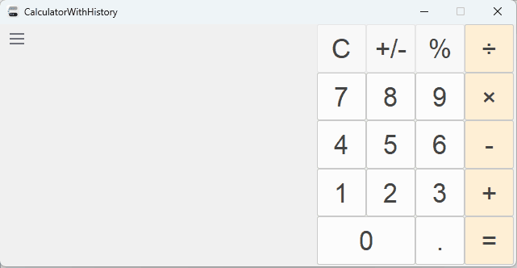

# CalculatorWithHistory
  

CalculatorWithHistory is a simple calculator application that aims to provide a convenient and intuitive way to perform calculations. It has a display that shows the calculation history, allowing you to review and reuse previous results. It also has a feature that highlights the numbers that are equal to values from previous calculations, making it easier to spot patterns and connections.

## Screenshot

## Usage
You can download and unzip the binary package from the [release page](https://github.com/wenjie23/CalculatorWithHistory/releases) and run the executable file.

## Features

- Basic mathematical calculation.
- A display that shows the calculation history.
- Highlighting of the numbers that are equal to values from previous calculation.
- A menu with actions to toggle the highlighting, copy the history to the clipboard, and clear the history.

## Todo

This app is still at a very early stage and there are many features and details to be refined. Some of them are:

- Scientific operators.
- Display with auto-hidden scroll bars.
- Release on other platforms.

## License

This project uses the [GPL v3 license](https://www.gnu.org/licenses/gpl-3.0.html) for the source code.
